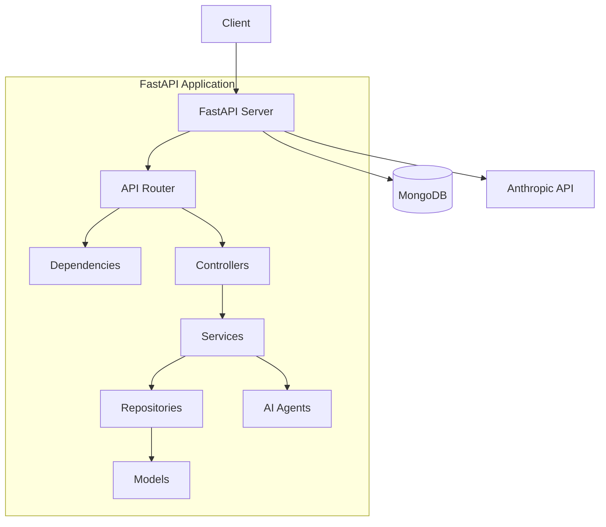
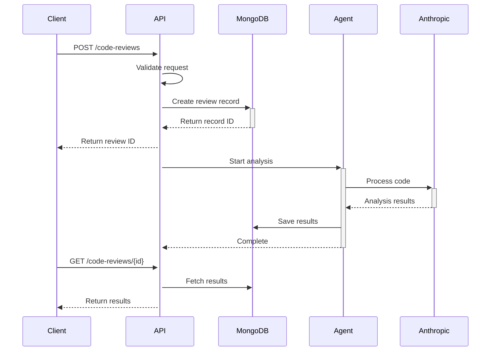

# Defra AI Code Review API Architecture

## Overview

The Defra AI Code Review API is a service that performs automated code reviews using AI technology. It analyzes code repositories against established standards and provides detailed feedback.

## System Architecture



## Core Components

### 1. API Layer (`src/api/`)
- FastAPI-based REST endpoints
- Route handlers for code review operations
- Input validation using Pydantic models
- Asynchronous request handling
- API versioning (v1)

### 2. Models (`src/models/`)
- Pydantic models for data validation
- MongoDB document schemas
- Type definitions and enums
- Request/response models

### 3. Repositories (`src/repositories/`)
- Data access layer
- MongoDB operations using Motor
- CRUD operations for entities
- Query builders

### 4. Agents (`src/agents/`)
- AI agent implementations
- Anthropic API integration
- Code analysis logic
- Standards checking

### 5. Dependencies (`src/dependencies.py`)
- FastAPI dependency injection
- Database connections
- Configuration management
- Service initialization

### 6. Configuration (`src/config.py`)
- Environment variables
- Application settings
- Service configurations
- Logging setup

## Data Model

### MongoDB Collections

#### CodeReview Collection
```typescript
interface CodeReview {
    _id: ObjectId;              // Unique identifier
    repository_url: string;     // Repository URL to analyze
    status: ReviewStatus;       // Current review status
    created_at: DateTime;       // Creation timestamp
    updated_at: DateTime;       // Last update timestamp
    results: ReviewResult[];    // Analysis results
}

enum ReviewStatus {
    STARTED = "started",
    COMPLETED = "completed",
    FAILED = "failed"
}

interface ReviewResult {
    file: string;              // File path
    line: number;              // Line number
    message: string;           // Review comment
    severity: string;          // Issue severity
    rule: string;             // Violated rule
}
```

## API Endpoints

### Base URL: `/api/v1`

| Method | Endpoint | Description |
|--------|----------|-------------|
| POST | `/code-reviews` | Create new review |
| GET | `/code-reviews` | List all reviews |
| GET | `/code-reviews/{id}` | Get specific review |
| GET | `/code-reviews/{id}/results` | Get review results |

## Authentication & Security

Current:
- Environment-based configuration
- Input validation
- Error handling
- Secure MongoDB connections

Planned:
- API key authentication
- Rate limiting
- Role-based access control

## Error Handling

- Standardized error responses
- HTTP status codes
- Detailed error messages
- Error logging

## Data Flow

### Code Review Process



## Development Setup

### Requirements
- Python 3.8+
- MongoDB
- Docker (optional)

### Configuration
- `.env` file for environment variables
- `requirements.txt` for Python dependencies
- `docker-compose.yml` for containerization

## Testing

### Framework
- pytest for unit and integration tests
- pytest-asyncio for async testing
- pytest-cov for coverage reporting

### Test Types
- Unit tests for individual components
- Integration tests for API endpoints
- Mock tests for external services

## Logging

- Structured logging using Python's logging module
- Log levels for different environments
- Rotating file handlers
- Console output for development

## Future Considerations

1. **Scalability**
   - Horizontal scaling of API servers
   - MongoDB replication
   - Caching layer

2. **Features**
   - Support for multiple AI providers
   - Custom rule definitions
   - Real-time analysis updates
   - Webhook notifications

3. **Integration**
   - CI/CD pipeline integration
   - GitHub/GitLab integration
   - Team collaboration features
