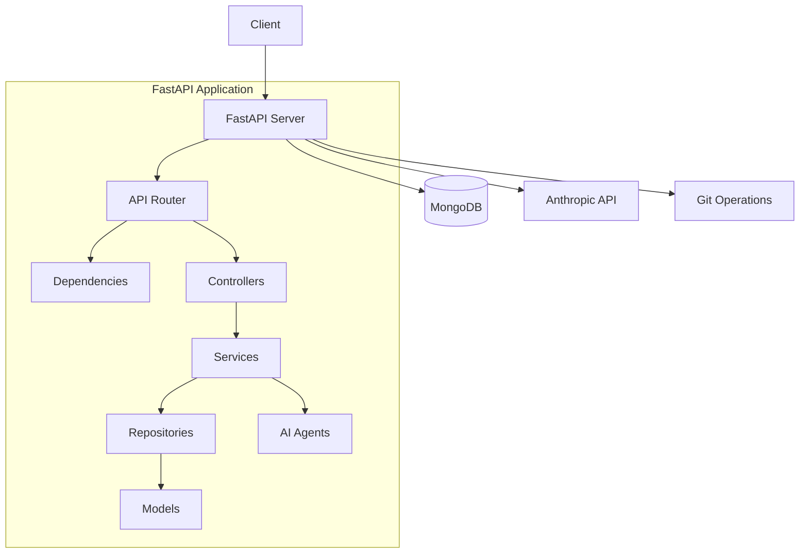
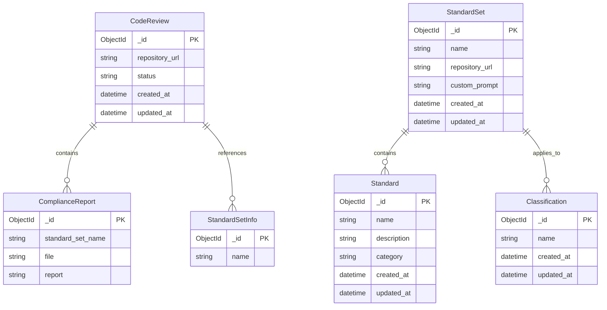
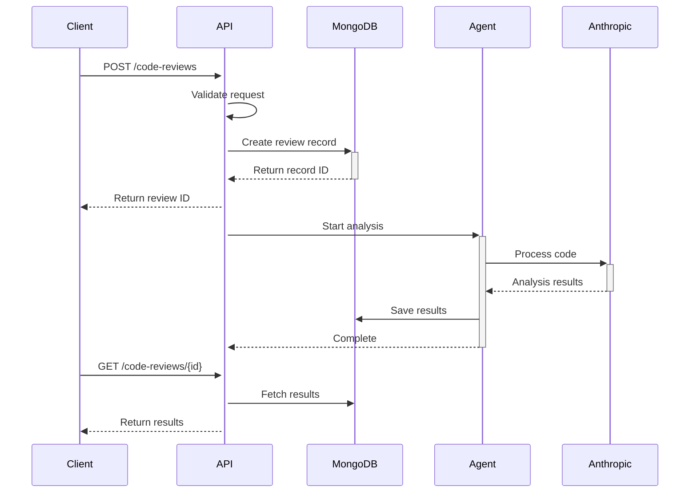

# Defra AI Code Review API Architecture

## Overview

The Defra AI Code Review API is a service that performs automated code reviews using AI technology. It analyzes code repositories against established standards and provides detailed feedback.

## System Architecture



## Core Components

### 1. API Layer (`src/api/`)
- FastAPI-based REST endpoints
- Route handlers for code review operations
- Input validation using Pydantic models
- Asynchronous request handling
- API versioning (v1)
- Health check endpoints
- Standard set management
- Classification endpoints

### 2. Models (`src/models/`)
- Pydantic models for data validation
- MongoDB document schemas
- Type definitions and enums
- Request/response models
- Custom type handlers (PyObjectId)

### 3. Repositories (`src/repositories/`)
- Data access layer
- MongoDB operations using Motor
- CRUD operations for entities
- Query builders
- Schema validation enforcement

### 4. Agents (`src/agents/`)
- AI agent implementations
- Anthropic API integration
- Code analysis logic
- Standards checking
- Git repository analysis
- Classification processing

### 5. Dependencies (`src/dependencies.py`)
- FastAPI dependency injection
- Database connections
- Configuration management
- Service initialization
- Authentication middleware

### 6. Configuration (`src/config.py`)
- Environment variables
- Application settings
- Service configurations
- Logging setup
- Git operation settings

## Data Model

### MongoDB Collections

#### CodeReview Collection
```typescript
interface CodeReview {
    _id: ObjectId;              // Unique identifier
    repository_url: string;     // Repository URL to analyze
    status: ReviewStatus;       // Current review status
    standard_sets: StandardSetInfo[]; // Associated standard sets
    compliance_reports: ComplianceReport[]; // Review results
    created_at: DateTime;       // Creation timestamp
    updated_at: DateTime;       // Last update timestamp
    error_message?: string;     // Optional error message
    git_ref?: string;          // Optional Git reference (branch/tag)
}

enum ReviewStatus {
    STARTED = "started",        // Review has been created
    IN_PROGRESS = "in_progress",// Review is being processed
    COMPLETED = "completed",    // Review has finished successfully
    FAILED = "failed"          // Review encountered an error
}

interface StandardSetInfo {
    _id: ObjectId;             // Standard set identifier
    name: string;              // Name of the standard set
    version?: string;          // Optional version information
}

interface ComplianceReport {
    _id: ObjectId;             // Report identifier
    standard_set_name: string; // Name of the standard set
    file_path: string;        // File path being reviewed
    report: string;           // Detailed compliance report
    issues: Issue[];          // List of identified issues
    score?: number;           // Optional compliance score
}

interface Issue {
    severity: IssueSeverity;  // Issue severity level
    message: string;          // Issue description
    line_number?: number;     // Optional line number
    rule_id?: string;        // Optional reference to violated rule
}

enum IssueSeverity {
    INFO = "info",
    WARNING = "warning",
    ERROR = "error"
}
```

### Custom Types

#### PyObjectId
A custom type for handling MongoDB ObjectIds that:
- Validates 24-character hexadecimal strings
- Handles both string and ObjectId inputs
- Provides JSON schema validation
- Ensures consistent serialization

Example:
```json
{
    "_id": "507f1f77bcf86cd799439011",
    "repository_url": "https://github.com/org/repo",
    "status": "in_progress",
    "standard_sets": [
        {
            "_id": "507f1f77bcf86cd799439012",
            "name": "Python Standards"
        }
    ],
    "compliance_reports": [
        {
            "_id": "507f1f77bcf86cd799439013",
            "standard_set_name": "Python Standards",
            "file": "src/main.py",
            "report": "Code follows PEP 8 guidelines..."
        }
    ],
    "created_at": "2024-01-01T00:00:00Z",
    "updated_at": "2024-01-01T00:00:00Z"
}
```

## Database Schema

### Collections Schema Validation

#### Classifications Collection
```typescript
{
    bsonType: "object",
    required: ["name"],
    properties: {
        _id: {
            bsonType: "objectId",
            description: "Unique identifier"
        },
        name: {
            bsonType: "string",
            description: "Classification name"
        }
    }
}
```

#### Standard Sets Collection
```typescript
{
    bsonType: "object",
    required: ["name", "repository_url"],
    properties: {
        _id: {
            bsonType: "objectId",
            description: "Unique identifier"
        },
        name: {
            bsonType: "string",
            description: "Standard set name"
        },
        repository_url: {
            bsonType: "string",
            description: "URL of the repository containing standards"
        },
        custom_prompt: {
            bsonType: "string",
            description: "Custom prompt for LLM processing"
        },
        created_at: {
            bsonType: "date",
            description: "Creation timestamp"
        },
        updated_at: {
            bsonType: "date",
            description: "Last update timestamp"
        }
    }
}
```

#### Standards Collection
```typescript
{
    bsonType: "object",
    required: ["text", "repository_path", "standard_set_id", "classification_ids", "created_at", "updated_at"],
    properties: {
        _id: {
            bsonType: "objectId",
            description: "Unique identifier"
        },
        text: {
            bsonType: "string",
            description: "Standard text content"
        },
        repository_path: {
            bsonType: "string",
            description: "Path to the standard in the repository"
        },
        standard_set_id: {
            bsonType: "objectId",
            description: "Reference to the standard set"
        },
        classification_ids: {
            bsonType: "array",
            items: {
                bsonType: "objectId",
                description: "Reference to classifications"
            },
            description: "List of classification references"
        },
        created_at: {
            bsonType: "date",
            description: "Creation timestamp"
        },
        updated_at: {
            bsonType: "date",
            description: "Last update timestamp"
        }
    }
}
```

#### Code Reviews Collection
```typescript
{
    bsonType: "object",
    required: ["repository_url", "status", "standard_sets", "created_at", "updated_at"],
    properties: {
        _id: {
            bsonType: "objectId",
            description: "Unique identifier"
        },
        repository_url: {
            bsonType: "string",
            description: "Repository URL to analyze"
        },
        status: {
            enum: ["started", "in_progress", "completed", "failed"],
            description: "Current review status"
        },
        standard_sets: {
            bsonType: "array",
            items: {
                bsonType: "object",
                required: ["_id", "name"],
                properties: {
                    _id: {
                        bsonType: "objectId",
                        description: "Standard set identifier"
                    },
                    name: {
                        bsonType: "string",
                        description: "Name of the standard set"
                    }
                }
            }
        },
        compliance_reports: {
            bsonType: "array",
            items: {
                bsonType: "object",
                required: ["_id", "standard_set_name", "file", "report"],
                properties: {
                    _id: {
                        bsonType: "objectId",
                        description: "Report identifier"
                    },
                    standard_set_name: {
                        bsonType: "string",
                        description: "Name of the standard set"
                    },
                    file: {
                        bsonType: "string",
                        description: "File path being reviewed"
                    },
                    report: {
                        bsonType: "string",
                        description: "Detailed compliance report"
                    }
                }
            }
        },
        created_at: {
            bsonType: "date",
            description: "Creation timestamp"
        },
        updated_at: {
            bsonType: "date",
            description: "Last update timestamp"
        }
    }
}
```

### Collections Diagram


### Collection Details

#### code_reviews
Primary collection for storing code review requests and results.
- Indexed Fields: `_id`, `repository_url`, `status`
- Contains embedded documents: `compliance_reports`, `standard_sets`
- Status enum: `started`, `in_progress`, `completed`, `failed`

#### standard_sets
Stores predefined sets of standards to check against.
- Indexed Fields: `_id`, `name`
- Contains custom prompts for AI processing
- References standards and classifications

#### standards
Individual standards within standard sets.
- Indexed Fields: `_id`, `name`, `category`
- Linked to standard sets
- Contains detailed standard descriptions

#### classifications
Technology/language classifications.
- Indexed Fields: `_id`, `name`
- Used to categorize standard sets
- Examples: Python, Java, Node.js

### Example Queries

```javascript
// Get all code reviews for a repository
db.code_reviews.find({ 
    repository_url: "https://github.com/org/repo" 
})

// Get completed reviews with compliance reports
db.code_reviews.find({ 
    status: "completed" 
}, {
    compliance_reports: 1
})

// Get standard sets by classification
db.standard_sets.find({
    "classifications.name": "Python"
})
```

## API Endpoints

### Base URL: `/api/v1`

| Method | Endpoint | Description |
|--------|----------|-------------|
| POST | `/code-reviews` | Create new review |
| GET | `/code-reviews` | List all reviews |
| GET | `/code-reviews/{id}` | Get specific review |
| GET | `/code-reviews/{id}/results` | Get review results |

## Authentication & Security

Current:
- Environment-based configuration
- Input validation
- Error handling
- Secure MongoDB connections

Planned:
- API key authentication
- Rate limiting
- Role-based access control

## Error Handling

- Standardized error responses
- HTTP status codes
- Detailed error messages
- Error logging

## Data Flow

### Code Review Process



## Development Setup

### Requirements
- Python 3.8+
- MongoDB
- Docker (optional)

### Configuration
- `.env` file for environment variables
- `requirements.txt` for Python dependencies
- `docker-compose.yml` for containerization

## Testing

### Framework
- pytest for unit and integration tests
- pytest-asyncio for async testing
- pytest-cov for coverage reporting

### Test Types
- Unit tests for individual components
- Integration tests for API endpoints
- Mock tests for external services

## Logging

- Structured logging using Python's logging module
- Log levels for different environments
- Rotating file handlers
- Console output for development

## Future Considerations

1. **Scalability**
   - Horizontal scaling of API servers
   - MongoDB replication
   - Caching layer

2. **Features**
   - Support for multiple AI providers
   - Custom rule definitions
   - Real-time analysis updates
   - Webhook notifications

3. **Integration**
   - CI/CD pipeline integration
   - GitHub/GitLab integration
   - Team collaboration features
