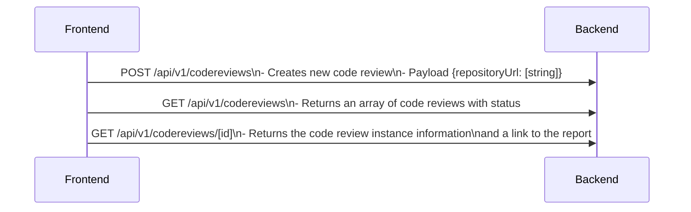

```mermaid
sequenceDiagram
    participant Frontend
    participant Backend

    Frontend->>Backend: POST /api/v1/codereviews\n- Creates new code review\n- Payload {repositoryUrl: [string]}
    Frontend->>Backend: GET /api/v1/codereviews\n- Returns an array of code reviews with status
    Frontend->>Backend: GET /api/v1/codereviews/[id]\n- Returns the code review instance information\nand a link to the report

```
