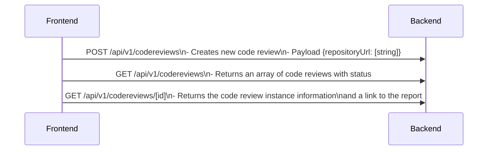
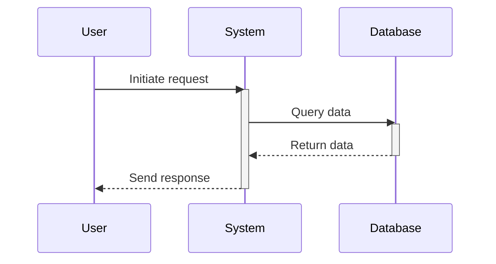

```mermaid
sequenceDiagram
    participant Frontend
    participant Backend

    Frontend->>Backend: POST /api/v1/codereviews\n- Creates new code review\n- Payload {repositoryUrl: [string]}
    Frontend->>Backend: GET /api/v1/codereviews\n- Returns an array of code reviews with status
    Frontend->>Backend: GET /api/v1/codereviews/[id]\n- Returns the code review instance information\nand a link to the report

```

```mermaid
sequenceDiagram

participant User

participant System

participant Database

  

User->>System: Initiate request

activate System

  

System->>Database: Query data

activate Database

  

Database-->>System: Return data

deactivate Database

  

System-->>User: Send response

deactivate System
```

