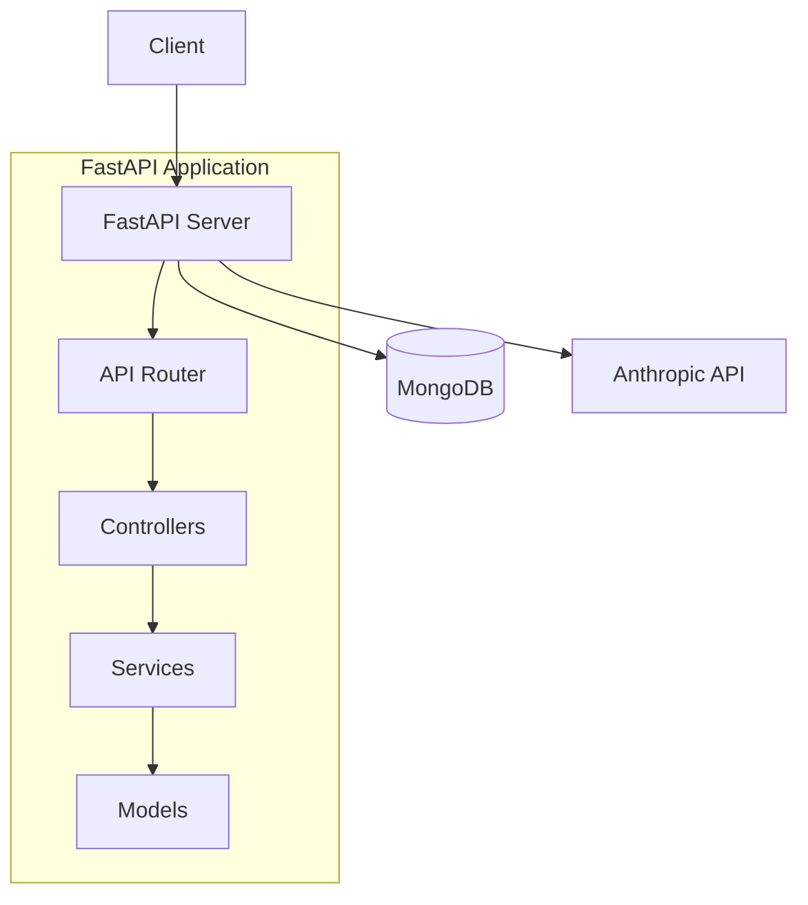
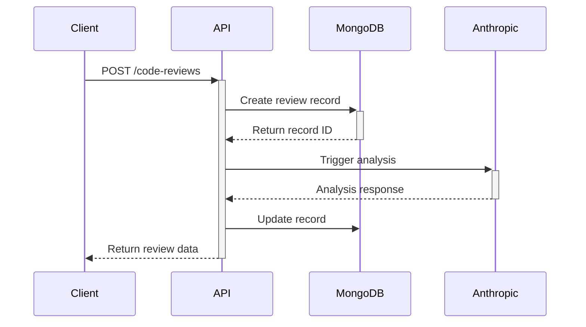
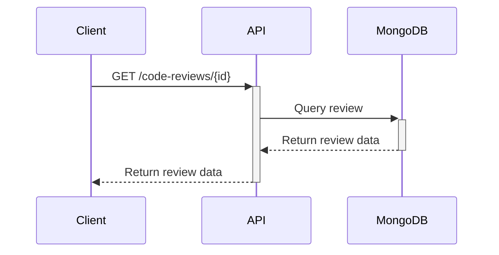

# Architecture Overview

## System Architecture

## Core Components

### 1. API Layer (`src/api/v1/`)
- REST API endpoints using FastAPI
- Route handlers for code review CRUD operations
- Input validation and response serialization
- Asynchronous request handling

### 2. Models (`src/models/`)
- Pydantic models for data validation
- MongoDB document schemas
- Type definitions and enums

### 3. Services (`src/services/`)
- Business logic implementation
- External service integrations (Anthropic)
- Asynchronous operations

### 4. Data Layer
- MongoDB for persistent storage
- Asynchronous database operations using Motor

## Key Design Decisions

### 1. Asynchronous Processing
- FastAPI for async HTTP handling
- Motor for async MongoDB operations
- Async Anthropic API integration

### 2. Data Model Design
- Document-based storage using MongoDB
- Flexible schema for future extensions
- Timestamps for audit tracking

### 3. Error Handling
- Centralized error handling
- HTTP status code standardization
- Structured error responses

## Data Flow

1. **Code Review Creation**:

2. **Code Review Retrieval**:
