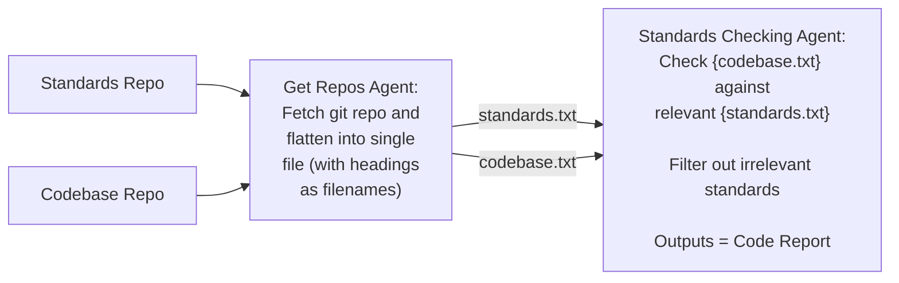

-----

Create a detailed PRD document in an markdown format outlining the following feature requirements.  I want the PRD to be in a single downloadable markdown file.  Ensure you use the best practices standards.
## Context

We are going to be extending an existing micro service that contains a number of REST API’s. It is written in python using the fastapi.  We want to extend functionality of the '/api/v1/codereviews' endpoint to call a new asynchronous agent as defined below.

## Sequence Overview:

POST /api/v1/codereviews (payload = 'repository_url') --> 'Git Repos Agent' --> 'Standards Checking Agent' --> Output report to text file

### Git Repos Agent Feature Requirements:

Create a 'Git repos agent' that will do the following:
- Download the repository passed from the API endpoint (POST /api/v1/codereviews (payload = 'repository_url'))
- Loop over each file within the repository and flatten its contents into a single text file with it's name being the same as the initial repository which will be saved in a '/data/codebase' directory with a heading for each files contents being the filename of the ingested file
	- If the file already exists, overwrite it
- Download a hardcoded standards git repository (URL = https://github.com/DEFRA/software-development-standards)
- Loop over each file within the hardcoded standards repository and flatten its contents into a single file with it's name being the same as the initial repository which will be saved in 'data/standards' directory with a heading for each files contents being the filename of the ingested file
	- If the file already exists, overwrite it
- The output of this will consumed by 'Standards Checking Agent' which will take the flattened file paths for both the codebase and the standards files as inputs.

### Standards Checking Agent Feature Requirements:

Create a 'Standards Checking Agent' that will do the following:
- The 'Standards Checking Agent' will consume the output from the 'Git repos agent', being two filepaths of the flattened files with the contents of the codebase and the standards.
- Create a user prompts using the following context:
	- _description_="Analyzes code compliance against standards",

            _instructions_=[

                "You are a code compliance analysis expert",

                "Analyze code against compliance standards",

                "Determine if code meets each standard",

                "Provide detailed recommendations for non-compliant areas",

                "Consider the codebase as a whole when evaluating compliance"
- Create a prompt using the contents of the two files along the lines of
	- f'''You are a senior software engineer responsible for ensuring code consistency across a companies software deliveries.
		Given each of the standards below: 
		{standards}.
		
		Compare the entire codebase of the submitted repository below, to assess how well the relevant standards are adhered to:
		
		{codebase}
		
		For each standard:
		- Determine if the codebase as a whole is compliant (true/false)
		- List specific files/sections relevant to the standard
		- If non-compliant, provide detailed recommendations
		- Consider dependencies and interactions between different parts of the code
		
		Generate a detailed compliance report that includes:
		- Overall compliance assessment
		- Per-standard analysis
		- Specific recommendations for improvements
		'''
- the model we want to use is Anthropic claude-3-5-sonnet-20241022

## Coding Standards:
- Generate verbose logging information when generating code to aid with debugging

## Behaviours not to do

- Don't change any other API endpoints
- Don't include any non-functional requirements
- 